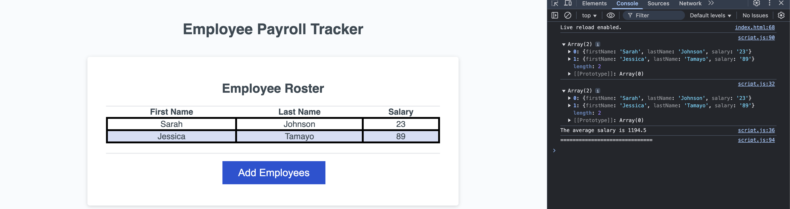

# Employee Payroll Tracker Starter Code

##Description

The Employee Payroll Tracker allows you to manage and track employee data by adding employees, inputting their first name, last name, and salary. Once an employee is added, you can choose to continue adding new employees or cancel the process, at which point your employee data is displayed sorted alphabetically by last name, and computed payroll data is aggregated and shown in the console.

##Features

Add employees with prompts for:
First name
Last name
Salary
Display a list of employees sorted alphabetically by last name.
Show computed and aggregated payroll data in the console (e.g., total salary, average salary, etc.).
Option to continue adding new employees or cancel the process.

##How to Use

Click the "Add employee" button to start adding employees.
You will be prompted for the employee's first name, last name, and salary. Fill out the information for each employee.
After adding an employee, you will be asked whether you would like to continue or cancel.
Click Continue to add another employee.
Click Cancel to stop adding employees.
When you cancel, the list of employees will be displayed, sorted alphabetically by their last name.
The console will show the aggregated payroll data such as the total salary and average salary.

##Example Workflow

Click the "Add employee" button.
Enter the details for an employee:
First Name: John
Last Name: Doe
Salary: 50000
After adding John, you will be prompted to Continue or Cancel.
Click Continue and add another employee:
First Name: Jane
Last Name: Smith
Salary: 60000
After adding Jane, click Cancel to finish.
Your employees will now be displayed, sorted alphabetically by last name:
Jane Smith - $60000
John Doe - $50000
The console will display computed payroll data like:
Total Salary: $110000
Average Salary: $55000

##Requirements

Modern web browser (Chrome, Firefox, etc.)
JavaScript enabled

##Technologies Used

HTML
CSS
JavaScript
